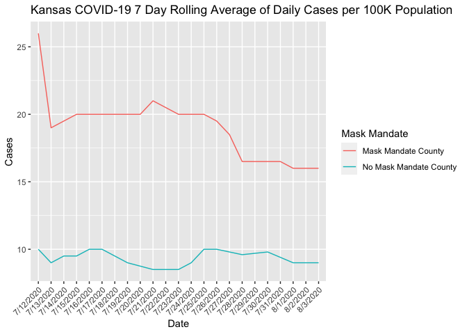

Lab 07 - Conveying the right message through visualisation
================
Marq Schieber
3/14/2022

### Load packages and data

``` r
library(tidyverse) 
```

### Exercise 1 Create a data frame that can be used to re-construct this visualization. You may need to guess some of the numbers, that’s ok. You should first think about how many rows and columns you’ll need and what you want to call your variables. Then, you can use the tribble() function for this. For example, if you wanted to construct the following data frame

``` r
df <- tribble(
  ~date, ~maskcount, ~nomaskcount,
  "7/12/2020", 26, 10,
  "7/13/2020", 19, 9,
  "7/14/2020", 19.5, 9.5,
  "7/15/2020", 20, 9.5,
  "7/16/2020", 20, 10,
  "7/17/2020", 20, 10,
  "7/18/2020", 20, 9.5,
  "7/19/2020", 20, 9,
  "7/20/2020", 20, 8.75,
  "7/21/2020", 21, 8.5,
  "7/22/2020", 20.5, 8.5,
  "7/23/2020", 20, 8.5,
  "7/24/2020", 20, 9,
  "7/25/2020", 20, 10,
  "7/26/2020", 19.5, 10,
  "7/27/2020", 18.5, 9.8,
  "7/28/2020", 16.5, 9.6,
  "7/29/2020", 16.5, 9.7,
  "7/30/2020", 16.5, 9.8,
  "7/31/2020", 16.5, 9.4,
  "8/1/2020" , 16.0, 9,
  "8/2/2020" , 16.0, 9,
  "8/3/2020" , 16.0, 9,
)
```

### Exercise 2 Make a visualization that more accurately (and honestly) tells the story.

``` r
df_longer <- df %>% 
  pivot_longer(!date , names_to = "mask_mandate" , values_to = "cases")
```

``` r
ggplot(df_longer, aes(x = date , y = cases ,group = mask_mandate , color = mask_mandate))+
  geom_line() +
  labs(title = "Kansas COVID-19 7 Day Rolling Average of Daily Cases per 100K Population", x = "Date" , y = "Cases")+
  scale_colour_discrete(name = "Mask Mandate" , labels = c("Mask Mandate County" , "No Mask Mandate County"))+
theme(axis.text.x = element_text(angle = 45, vjust = 1, hjust=1))
```

<!-- --> \### Exercise
3 What message is more clear in your visualization than it was in the
original visualization?

It is more clear in the new visualization that cases in the mask mandate
county decreased over time, whereas the no mask mandate county cases
stayed the same.

### Exercise 4 What, if any, useful information do these data and your visualization tell us about mask wearing and COVID? It’ll be difficult to set aside what you already know about mask wearing, but you should try to focus only on what this visualization tells. Feel free to also comment on whether that lines up with what you know about mask wearing.

Considering the mask mandate county started with many more cases than
the no mask county, I would be interested in some background info on
these counties including: type of county (aka urban or rural) and
population size.
